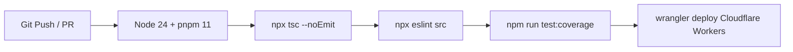

# 📕 PaddlePal 技术架构蓝图 (Technical Architecture, TA)

本文档定义 PaddlePal（拍档）乒乓球赛事管理系统的 **技术架构 (TA)**，涵盖技术选型、Cloudflare 边缘资源绑定、性能与 SLA 限制指标以及 CI/CD 自动化门禁。

---

## 一、 技术选型与依赖基线

| 维度 | 选型/技术 | 版本/规范 | 说明 |
| :--- | :--- | :--- | :--- |
| **运行时 (Runtime)** | Cloudflare Workers | Node.js >=24.18.1 / ES Module | 无服务器边缘计算环境 |
| **包管理器 (Package)** | pnpm | >=11.19.0 | 顶层 `overrides` & `onlyBuiltDependencies` |
| **Web 框架 (Framework)** | Hono + JSX | ^4.12.34 | 极轻量边缘 SSR 框架 |
| **语言 (Language)** | TypeScript | ^5.9.3 | 严格模式 (Strict)，禁止 `any` |
| **CLI / 工具链** | Wrangler | ^4.121.0 | Cloudflare 官方部署与测试工具 |
| **测试框架 (Testing)** | Vitest | ^4.1.10 | 高速单元测试框架 |

---

## 二、 Cloudflare 边缘绑定架构 (`wrangler.toml`)

```toml
name = "paddlepal"
main = "src/index.ts"
compatibility_date = "2026-07-01"

[[d1_databases]]
binding = "DB"
database_name = "paddlepal-db"
database_id = "<d1-database-id>"

[[kv_namespaces]]
binding = "SESSIONS"
id = "<kv-namespace-id>"

[[r2_buckets]]
binding = "FILES"
bucket_name = "paddlepal-files"

[durable_objects]
bindings = [{ name = "DO", class_name = "DO" }]

[[queues.producers]]
binding = "QUEUE"
queue = "paddlepal-heavy-tasks"

[[queues.consumers]]
queue = "paddlepal-heavy-tasks"
max_batch_size = 10
max_batch_timeout = 5
```

---

## 三、 边缘计算性能与 SLA 限制指标 (Performance & SLA)

1. **接口响应延迟 (Edge Latency)**：P95 目标响应时间 < 50ms（利用 Cloudflare 全球边缘节点覆盖）。
2. **实时广播延迟 (WebSocket SLA)**：比分录入到大屏渲染延迟 < 100ms。
3. **Worker 执行限制与队列解耦**：单次 HTTP 请求 CPU 时间限制为 50ms。对于大规模复杂赛制（如百人级多重循环赛积分重算与排名生成），将重型计算任务从 HTTP 线程剥离，通过 **Cloudflare Queues** 进行后台异步计算，突破 50ms 算力红线。
4. **D1 读写限制优化**：在高频大屏查询路由（`/api/live`）中增加复合索引，保证即使在 100 个球台并发时仍不超限。

---

## 四、 离线与弱网容错网络拓扑 (Offline-First Strategy)

针对体育馆信号拥堵、Wi-Fi 不稳定场景：
1. **裁判端本地缓存 (Umpire Local Buffer)**：裁判手机端使用 IndexedDB / LocalStorage 暂存未发送成功的得分指令。
2. **状态自动重连与同步 (Auto-Reconnection)**：断网恢复后，带上 Timestamp 与 Transaction ID 按序向 Durable Objects 批量补发，自动合并状态。

---

## 五、 CI/CD 自动化门禁与部署管道 (Automation Pipeline)

代码变更提交至 GitHub 仓库后，自动触发 GitHub Actions 门禁工作流 (`.github/workflows/deploy.yml`)：



---

## 六、 测试策略与工程保障 (Testing Strategy & Coverage)

项目采用 `Vitest` 构建高覆盖率的工程测试基座：
1. **核心算法测试 (Unit Tests)**：业务核心逻辑（如 `scoring.ts`、`validate.ts`、`utils.ts`）剥离了所有外部依赖，进行纯粹的单元测试，确保比分计算、赛制流转与异常处理逻辑（代码覆盖率 > 90%）绝对准确。
2. **API 路由集成测试 (Integration Tests)**：针对 `src/routes/` 目录下的全量接口（如 `public-api.ts`、`util-api.ts`），采用以下架构进行高速集成测试：
   - **原生 Hono 调用**：利用 Hono 自带的 `.request()` 方法，在内存中模拟发起 HTTP 请求，无需占用实际网络端口，执行速度极快。
   - **底层 D1 数据库 Mock (打桩)**：通过 `vitest` 的 `vi.fn()` 拦截并模拟底层 Cloudflare D1 数据库 ( `env.DB.prepare` ) 的 SQL 返回值，使测试用例完全脱离对真实数据库的依赖，保证测试的纯粹性与稳定性（不会产生脏数据）。
3. **覆盖率度量与门禁**：通过 `npm run test:coverage` 输出全局代码行级、分支级覆盖率报告，配合 GitHub Actions 形成闭环质量防护网。
